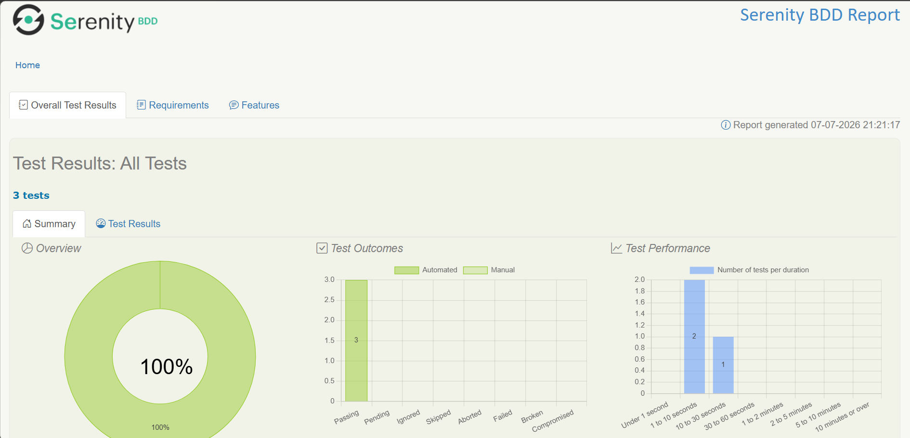
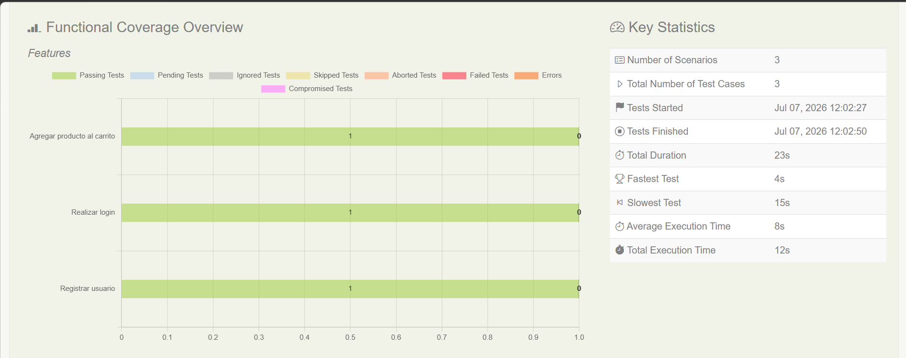
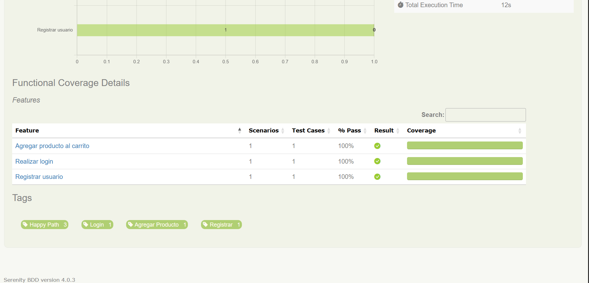

# Automatización de Pruebas con Serenity BDD


Proyecto de automatización de pruebas web desarrollado para la plataforma de prácticas **Demoblaze**. La suite utiliza el patrón de diseño **Screenplay**, garantizando pruebas legibles, escalables y desacopladas bajo un enfoque BDD (Behavior-Driven Development).

---

# Informe de Resultados (Serenity BDD Report)

A continuación, se adjuntan las capturas del reporte automatizado generado tras la ejecución exitosa de los casos de prueba de la suite.

## Resumen General del Test (100% Exitoso)



> *Métricas de efectividad que confirman que el 100% de los escenarios se encuentran en estado Passing.*

## Cobertura Funcional por Características



> *Estadísticas de tiempos de ejecución y estabilidad de los escenarios bajo el tag `@HappyPath`.*

## Detalle de Tags y Features Ejecutados



> *Desglose funcional de los tres módulos automatizados y sus respectivos niveles de validación.*

---

# Flujos Automatizados (Feature Files)

- **Registro de Usuario (`registrar_usuario.feature`)**: Creación de cuentas dinámicas en la plataforma Demoblaze.
- **Inicio de Sesión (`login.feature`)**: Autenticación de usuarios existentes con credenciales válidas.
- **Agregar Productos al Carrito (`agregar_producto.feature`)**: Flujo completo que inicia sesión, selecciona dinámicamente el dispositivo **Samsung Galaxy S6**, interactúa de manera segura con las alertas asíncronas nativas del navegador (*Product added*) y verifica su visualización final en la tabla del carrito.

---

# Arquitectura del Proyecto

Estructura modular orientada a objetos basada en el patrón de diseño **Screenplay**:

```text
src/
├── main/
│   └── java/
│       └── org.example/
│           ├── Pages/             # Definición de localizadores web (Targets)
│           │   ├── CarritoPage
│           │   ├── CatalogoPage
│           │   ├── HomePage
│           │   └── LoginPage
│           └── Tasks/             # Tareas ejecutables de alto nivel (Performables)
│               ├── AgregarAlCarrito
│               ├── IniciarSesion
│               ├── NavigateTo
│               ├── RegistrarUsuario
│               ├── SeleccionarProducto
│               └── VisualizarCarrito
└── test/
    ├── java/
    │   └── org.example/
    │       ├── steepDefinition/   # Pegamento (Glue) entre Gherkin y código Java
    │       │   ├── AgregarProductoStepDefinition
    │       │   ├── LoginStepDefinition
    │       │   ├── ParameterDefinition
    │       │   └── RegistrarUsuarioStepDefinition
    │       └── RunnerTest   # Orquestador central de pruebas de JUnit
    └── resources/
        ├── features/              # Casos de prueba descritos en Gherkin
        │   ├── agregar_producto.feature
        │   ├── login.feature
        │   └── registrar_usuario.feature
        └── serenity.conf          # Configuración del WebDriver y propiedades de Chrome
```

---

# Stack Tecnológico

> [!NOTE]
>
> - **Lenguaje Base:** Java 17.
> - **Framework Core:** Serenity BDD v4.0.3.
> - **BDD Engine:** Cucumber v3.1.20 integrado.
> - **Aseveraciones:** Serenity Ensure / AssertJ Core.
> - **Build Tool:** Maven.
> - **Entorno de Pruebas:** https://www.demoblaze.com/

---

# Instalación y Ejecución Local

> [!IMPORTANT]
>
> ## Requisitos Previos
>
> - Contar con **Java JDK 17** configurado en tus variables de entorno.
> - Tener **Apache Maven** instalado globalmente.
> - Google Chrome actualizado.

## 1. Clonar el Repositorio

```bash
git clone https://github.com/7Kitsu7/curso-web.git
cd curso-web
```

## 2. Ejecutar la Suite de Pruebas

Para compilar el proyecto y ejecutar todos los escenarios con la etiqueta `@HappyPath`:

```bash
mvn clean verify
```

## 3. Generar el Reporte HTML

Si deseas regenerar manualmente el reporte interactivo de Serenity:

```bash
mvn serenity:aggregate
```

> [!TIP]
>
> Una vez finalizada la ejecución, abre el reporte desde:
>
> ```text
> target/site/serenity/index.html
> ```
